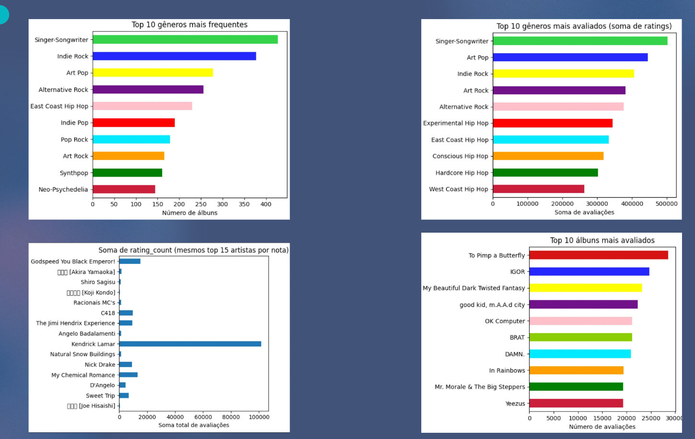
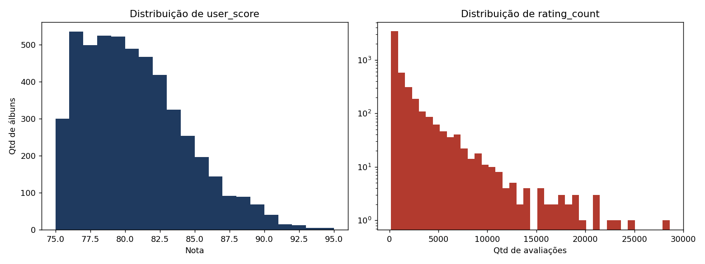
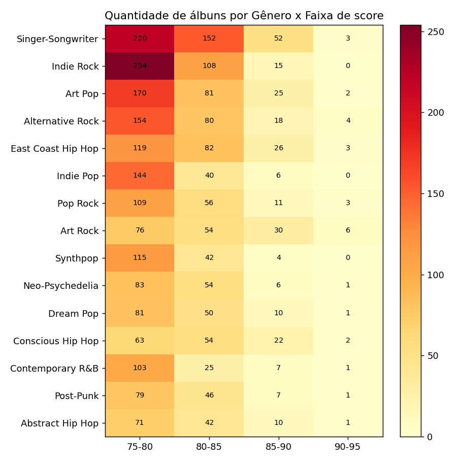

# EDA — Dataset AOTY (Album of the Year)

Análise exploratória de dados do Top 5.000 álbuns mais bem avaliados do
[AOTY](https://www.albumoftheyear.org), feita para a materia de **PISI-III**.

## 1. Dataset

Arquivo: `aoty.csv` — 5000 álbuns, sem nenhum valor ausente.

| Coluna | Descrição |
|---|---|
| `id` | identificador sequencial do álbum |
| `title` | título do álbum |
| `artist` | artista |
| `release_date` | data de lançamento |
| `genres` | um ou mais gêneros separados por vírgula |
| `user_score` | nota média dos usuários (75 a 95 na amostra) |
| `rating_count` | quantidade de avaliações |
| `album_link` | link da página do álbum no AOTY |

**Viés importante:** a amostra é só o *top 5000* — os álbuns mais bem
avaliados do site.

## 2. Gráficos exploratórios iniciais



- Top 10 gêneros mais frequentes (contagem de álbuns): Singer-Songwriter e
  Indie Rock dominam.
- Top 10 gêneros mais avaliados (soma de `rating_count`): ordem muda —
  hip hop ganha peso, mostrando que frequência de gênero e popularidade
  não são a mesma coisa.
- Soma de `rating_count` dos top 15 artistas por nota: Kendrick Lamar
  concentra volume muito acima dos demais.
- Top 10 álbuns mais avaliados: liderados por *To Pimp a Butterfly* e
  *IGOR*.

## 3. Tratamento dos dados (`tratamento_aoty.py`)

- Conversão de `rating_count` (texto "28,594 ratings") para número.
- Extração de `release_year` e `decade` a partir de `release_date`.
- "Explosão" de `genres`: como um álbum pode ter vários gêneros (média de
  2,1 gêneros/álbum), cada combinação (álbum, gênero) virou uma linha
  própria — necessário para qualquer análise agrupada por gênero.

## 4. Distribuições, correlação e tendência temporal (`eda_complementar.py`)



- **user_score**: concentrado entre 75 e 85 (mediana 80), cauda longa à
  direita — poucos álbuns acima de 90.
- **rating_count**: extremamente assimétrico (mediana 482, máximo 28.594)
  — poucos álbuns concentram a maior parte do volume de avaliações.
- **Correlação user_score × rating_count: 0,40** (positiva, moderada) —
  álbuns mais avaliados tendem a ter nota um pouco mais alta, mas a
  relação está longe de ser forte.
- **Nota média por década**: cai nas décadas mais recentes (2010: 79,5;
  2020: 78,3) frente a décadas anteriores (~81-82) — álbuns antigos que
  seguem no top 5000 já passaram pelo "teste do tempo"; os recentes ainda
  estão acumulando reputação.

## 5. Heatmap Gênero × Faixa de nota (`analise_aoty.py`)



Célula = quantidade de álbuns do gênero naquela faixa de `user_score`
(75-80 / 80-85 / 85-90 / 90-95), para os 15 gêneros mais frequentes.

- **Indie Rock** e **Indie Pop** concentram a esmagadora maioria dos
  álbuns na faixa 75-80 e quase não aparecem acima de 85.
- **Art Rock** e **Conscious Hip Hop**, apesar de menos frequentes, têm
  proporção bem maior de álbuns nas faixas mais altas (85-90 e 90-95).

Ou seja: dentro do grupo de elite, alguns gêneros se concentram mais perto
do teto de nota do que outros — não é só sobre quantidade, é sobre onde
essa quantidade se distribui.

## 6. Relevância para o app de recomendação

- **Viés de seleção**: base é só top 5000; cuidado ao usar como treino sem
  complementar com álbuns medianos/mal avaliados.
- **Gênero como sinal**: tratar como multi-label, não categoria única.
- **Popularidade ≠ qualidade**: correlação fraca entre `rating_count` e
  `user_score` — um recomendador baseado em popularidade teria lógica
  diferente de um baseado em nota.
- **Viés temporal**: nota bruta favorece obras antigas; considerar
  normalizar por década se a nota for usada como proxy de qualidade.


## Estrutura de arquivos

```
aoty_analise/
├── EDA_AOTY.md                  (este documento)
├── tratamento_aoty.py
├── analise_aoty.py
├── eda_complementar.py
├── graficos_exploratorios.png
├── heatmap_genero_x_score.png
├── distribuicoes.png
└── aoty_tratado/
    ├── aoty_tratado.csv
    ├── aoty_tratado_long.csv
    ├── metadados.json
    ├── dados_heatmap.json
    └── eda_complementar.json
```

### Como rodar

```bash
pip install pandas matplotlib
python3 tratamento_aoty.py
python3 analise_aoty.py
python3 eda_complementar.py
```
